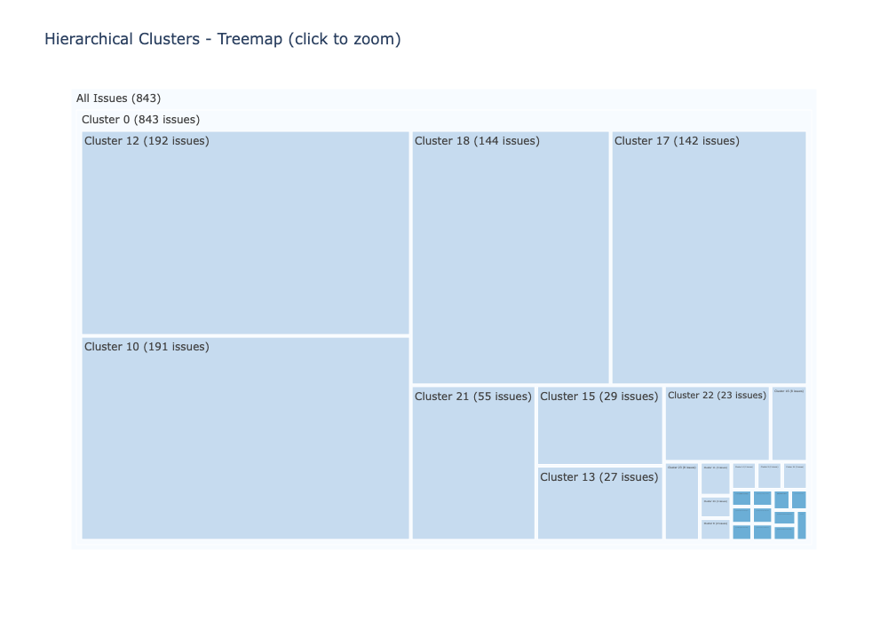
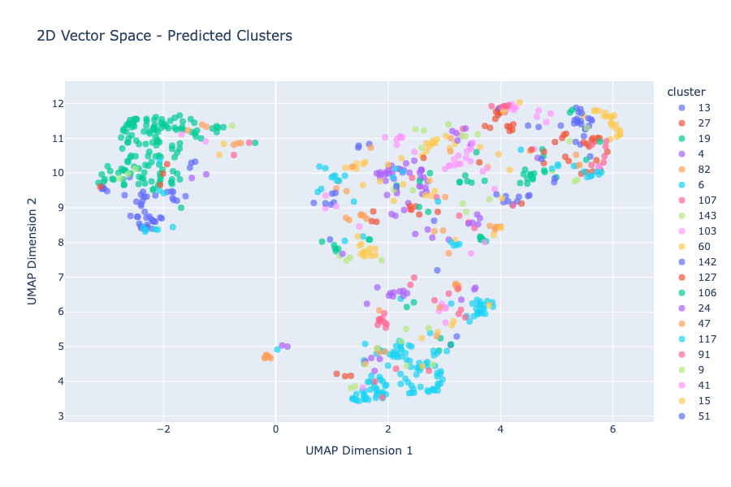

# GitHub Issue Clustering

Analyze and cluster GitHub issues using semantic embeddings. Automatically fetches issues from any GitHub repo, clusters them by similarity, and provides interactive visualizations.

## Features

- **Auto-fetch from GitHub**: Just set `REPO_NAME` and issues are fetched automatically
- **Hierarchical clustering**: Cluster at multiple similarity levels (50%, 65%, 80%) with navigable tree output
- **Embedding caching**: Embeddings saved locally to avoid recomputation
- **Multiple clustering strategies**: Agglomerative, vector-style neighbor join, centroid-style
- **Interactive visualizations**: Sunburst, treemap, dendrogram, 2D/3D UMAP plots
- **Markdown export**: Full cluster tree with issue titles, descriptions, and GitHub issue numbers
- **Cross-repo comparison**: Analyze multiple repos and compare clustering results

## Example Results

| Repo | Issues | Clusters (65%) | Singletons | Quality |
|------|--------|----------------|------------|---------|
| facebook/react | 843 | 27 | 11 | 7/10 |
| plotly/plotly.js | 500 | 59 | 24 | 7.5/10 |

Results saved to `results/{repo}_hierarchy.md` with full tree structure.

### Hierarchical Treemap (facebook/react)


### 2D Embedding Space


### 3D Embedding Space


## Quick Start

1. Create virtual environment:
   ```bash
   python -m venv venv && source venv/bin/activate
   pip install -r requirements.txt
   ```

2. Set up `.env` file:
   ```
   GOOGLE_API_KEY=your_gemini_api_key
   GITHUB_TOKEN=your_github_personal_access_token
   ```

3. Open `issue_clustering.ipynb` and set config:
   ```python
   REPO_NAME = "facebook/react"  # Any GitHub repo
   ISSUE_STATE = "open"          # "open", "closed", or "all"
   MAX_ISSUES = None             # None for no limit, or a number
   ```

4. Run all cells - issues will be fetched, embedded, clustered, and visualized.

## Directory Structure

```
├── data/                    # Cached issue CSVs (auto-created)
├── embeddings/              # Cached embedding numpy files (auto-created)
├── results/                 # Clustering results and markdown exports (auto-created)
├── issue_clustering.ipynb   # Main notebook
├── requirements.txt
└── .env                     # API keys (not committed)
```

## Configuration

| Variable | Description |
|----------|-------------|
| `REPO_NAME` | GitHub repo to analyze (e.g., `"plotly/plotly.js"`) |
| `ISSUE_STATE` | Filter by state: `"open"`, `"closed"`, or `"all"` |
| `MAX_ISSUES` | Limit issues fetched (`None` for all) |
| `FORCE_RECOMPUTE` | Set `True` to recompute embeddings even if cached |

## Hierarchical Clustering

Clusters issues at 3 similarity levels:

- **50% (loose)**: Broad topic groups
- **65% (medium)**: Related sub-topics
- **80% (tight)**: Very similar/duplicate issues

Output is a navigable tree:
```
📁 Cluster 12 @ 65% similarity (192 issues)
  📁 Cluster 147 @ 80% similarity (35 issues)
    📄 [#35569] React Compiler conditionally memoize...
    📄 [#35554] allow 'use no memo' inside callbacks
    📄 [#35386] .map() callback extracted breaks closure...
```

## Visualizations

- **Sunburst chart**: Click to zoom into cluster hierarchy
- **Treemap**: See relative cluster sizes
- **Dendrogram**: Full hierarchical structure with cut lines
- **2D/3D UMAP**: Embedding space visualization
- **Similarity heatmap**: Pairwise issue similarities

## Embedding Models

- **Default**: Gemini (`gemini-embedding-001`) - requires `GOOGLE_API_KEY`
- **Offline**: Any SentenceTransformer model (e.g., `all-MiniLM-L6-v2`)

## Notes

- Gemini API has 100-item batch limit - handled automatically with batching
- Issues cached locally after first fetch (invalidate by deleting CSV in `data/`)
- Markdown output includes actual GitHub issue numbers for easy lookup
- Clustering quality varies by repo - 65% threshold works well for most cases
